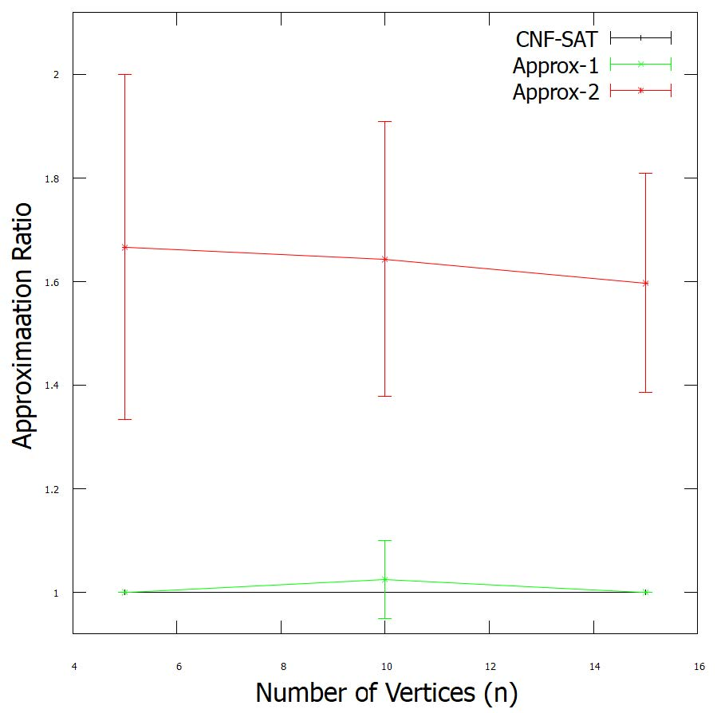

<!-- Reference:
https://github.com/othneildrew/Best-README-Template -->

<!-- PROJECT LOGO -->
 

  <h1><i>Vertex-Cover Optimization</i></h1>

  
  
  .

  

    An optimized encoding to solve vertex-cover problem !
  

 

<!-- TABLE OF CONTENTS -->

  
Table of Contents

  <ol>
    <li><a href="#about-the-project">About The Project</a></li>
    <li><a href="#built-with">Built With</a></li>
    <li><a href="#getting-started">Getting Started</a></li>
    <li><a href="#initial-encoding-vs-optimized-encoding-for-cnf-sat-vc">Initial Encoding v/s Optimized Encoding (for CNF SAT VC)</a></li>
    <li><a href="#license-or-author">License or Author</a></li>
    <li><a href="#contact">Contact</a></li>
    <li><a href="#acknowledgments">Acknowledgments</a></li>
  </ol>

 

<!-- ABOUT THE PROJECT -->
## About The Project
  In this project we've created an optimized encoding for solving the vertex cover problem using SAT solver and compared the results of different methods.
  * Implemented and analysed 2 polynomial-time & 1 NP-complete algorithm for solving the minimum vertex-cover problem.
  * Optimized the existing encoding of CNF-SAT solver (NP-complete) to provide most optimal result at > 50 % faster rate (for the initial cases).

  
  
(<a href="#readme-top">back to top</a>)

## Built With
  &nbsp; &nbsp; &nbsp;   &nbsp; &nbsp; &nbsp; &nbsp; &nbsp; &nbsp;  &nbsp; 

  &nbsp; &nbsp; &nbsp; &nbsp; &nbsp; &nbsp; &nbsp; <b><i> C++ </i></b> &nbsp; &nbsp; &nbsp; &nbsp; &nbsp; &nbsp; &nbsp; &nbsp; &nbsp; &nbsp; &nbsp; &nbsp; <b><i> Linux </i></b> &nbsp; &nbsp; &nbsp; &nbsp; &nbsp; &nbsp; &nbsp; &nbsp; &nbsp; &nbsp; &nbsp; &nbsp; <b><i> CMake </i></b>

  
(<a href="#readme-top">back to top</a>)

<!-- GETTING STARTED -->
## Getting Started
  #### Prerequisites
  * C++
  * Linux OS (Preferred - Ubuntu)
  * Machine Requirements: Minimum 4GB RAM, Intel i5 Processor (or Equivalent)

  
  #### Setup & Use
  * The entire repo makes-up the source code for the project.
  * <b>'ece650-prj.cpp'</b> is the main file or the starting point for the project.

  * ###### Build Commands
        cd /project
        git clone https://github.com/agurfinkel/minisat
        mkdir build
        cd build
        cmake ../
        make

  * ###### Automated Testing
        ./tests_ece650-a2
        ./tests_ece650-a4
        ./tests_ece650-prj

  * ###### Run
        ./ece650-prj

  #### Testing Sample Input
    cd /project/build

    bash

    ./ece650-prj < ../other_files/test_data/Test1.txt > ../other_files/test_data/Test1.out 2> ../other_files/test_data/Test1.err
    ./ece650-prj < ../other_files/test_data/Test2.txt > ../other_files/test_data/Test2.out 2> ../other_files/test_data/Test2.err
    ./ece650-prj < ../other_files/test_data/test_1000.txt > ../other_files/test_data/test_1000.out 2> ../other_files/test_data/test_1000.err

  
(<a href="#readme-top">back to top</a>)

<!-- Initial Encoding v/s Optimized Encoding -->
## Initial Encoding v/s Optimized Encoding (for CNF SAT VC)
  Detailed Report can be found in <b>'Report.pdf'</b> in the parent directory.
  * #### Initial (Basic) Encoding
    * ###### CNF-SAT-VC:
      The algorithm can be found on the last page of <b>'Reference/Acknowledgment-2.'</b>
    * ###### Approx-VC-1:
      1. Set: v_high = Vertex with highest degree (most incident edges).
      2. Add 'v_high' to VertexCover[]
      3. Throw away all edges incident to 'v_high'.
      4. Repeat '𝑆𝑡𝑒𝑝𝑠 1 -> 3' till no edges remain.
   
    * ###### Approx-VC-2:
      1. Set: first edge = First available 'Edge(src,dest)' in the Graph
      2. Add both 'src' and 'dest' to VertexCover[]
      3. Throw away all edges attached to 'src' and 'dest'.
      4. Repeat '𝑆𝑡𝑒𝑝𝑠 1 -> 3' till no edges remain.

     

    
   

     
  
    
  

    
  

     

    * On the basis of above analysis, we belive it's safe to say that APPROX-VC-2 is the fastest of all the three algorithms being considered, with APPROX-VC-1 being the next best.
    * CNF-SAT-VC still performs reasonably fast for n<= 10, although still not as fast as the other two. But falls behind for further values of 'n' and that too by a huge margin.
    * This is not surprising, as CNF-SAT-VC is NP-Complete, whereas the other 2 algorithms run in polynomial time.
  
   

  * #### Optimized Encoding for CNF-SAT-VC
    The revised algortihm for CNF-SAT-VC can be found in <b>'Report.pdf'</b> in the parent directory. The other 2 algorithms remain unchanged.

     

    
   

     

    * From the above analysis, it's obvious that CNF-SAT-VC produces the most optimal solution.
    * APPROX-VC-1 also performs reasonably well, even providing an optimal solution in a lot of cases. Overall, it is very close to optimal.
    * APPROX-VC-2 is very unpredictable and will never produce an optimal solution. (Since it will have atleast one redundant vertex in the vertex-cover).

     

  * #### Conclusion
    * If time-efficiency is the only requirement, than APPROX-VC-2 comes across as the most suitable option.
    * When output-efficiency (optimal result) is the only requirement, CNF-SAT-VC (with optimized encoding) is the best-fit, as it is guaranteed to produce minimum vertex-cover.
    * In cases, where both time-efficiency and optimality are important , we can explore the following options:
      1. Use optimized CNF-SAT-VC first. If it times out (adjust the timeout beforehand, as per requirement), then use APPROX-VC-1.
      2. Use only APPROX-VC-1: Although it is not guaranteed to produce an optimal solution; it is safe to say that the solution will be very close to being optimal (on the basis of above analysis)

  
(<a href="#readme-top">back to top</a>)

<!-- LICENSE -->
## License or Author
  * <b>Authored By</b> - Uditya Laad, Swapnil Baluja - University of Waterloo
  * <b>Initial Encoding</b> - &nbsp; Provided by Prof. Arie Gurfinkel, University of Waterloo, Waterloo, ON, CA

  
(<a href="#readme-top">back to top</a>)

<!-- CONTACT -->
## Contact
  <b>Uditya Laad</b> &nbsp; [@linkedin.com/in/uditya-laad-222680148](https://www.linkedin.com/in/uditya-laad-222680148/)
  
  &nbsp; &nbsp; &nbsp; &nbsp; &nbsp; &nbsp; &nbsp; &nbsp; &nbsp; &nbsp; &nbsp; [@github.com/udityalaad](https://github.com/udityalaad)
  
  &nbsp; &nbsp; &nbsp; &nbsp; &nbsp; &nbsp; &nbsp; &nbsp; &nbsp; &nbsp; &nbsp; udityalaad123@gmail.com

  <b>Project Link</b> &nbsp; [https://github.com/udityalaad/OptimizingVertexCoverProblem](https://github.com/udityalaad/OptimizingVertexCoverProblem)

  
(<a href="#readme-top">back to top</a>)

<!-- ACKNOWLEDGMENTS -->
## Acknowledgments
  * Author, Prof. Arie Gurfinkel., University of Waterloo, Waterloo: ECE 650 Project - uw-ece650-1221-prj.pdf (2022)
  * Author, Prof. Arie Gurfinkel., University of Waterloo, Waterloo: ECE 650 Assignment 4 - uw-ece650-1221-a4.pdf (2022)
  * Owner, Prof. Arie Gurfinkel., University of Waterloo: graphGen
  * [GNU Plot Home Page](http://gnuplot.sourceforge.net.)
  * [Minisat Home Page](http://minisat.se/.)
  * [Vertex Cover, Wikipedia](https://en.wikipedia.org/wiki/Vertex_cover)
  
  
(<a href="#readme-top">back to top</a>)

